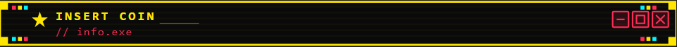

  

making games is the only thing i know how to do — and i love every second of it.

i'm a solo indie dev based in Aracaju, Brazil. i build whatever the game needs — shaders, gameplay systems, tools, art pipelines. no specialization, just whatever it takes to make the thing work and feel right.

my main objective is to be the kind of developer who has a direct connection with the people who play their games. like ConcernedApe shipping Stardew Valley out of pure love, or the folks at Black Tabby Games making something deeply personal and finding their people because of it. that kind of work is what i'm chasing.

---

### what i'm working on

- 🌿 **Projeto Liririandi** — isometric 3D pixel art game in Unity 6 URP
- 🎮 **FPS Gameplay Systems** — modular first-person framework (climbing, grab, trauma health)

---

### 🛠️ tools i use

 
 

### 📫 find me

> *"making games is the only thing i know how to do — and i love every second of it."*
